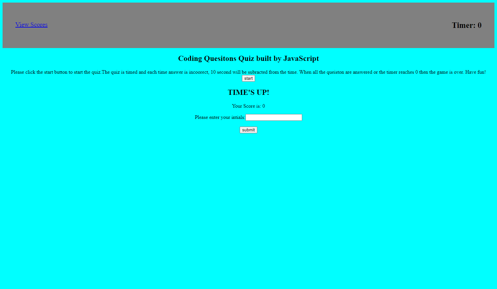

# Code-Quiz

## Description

- The motivation behind this project was to build a timed coding quiz with multiple-choice questions. This app will run in the browser and will feature dynamically updated HTML and CSS powered by JavaScript code that you write. 
- This project was built becasue at some point in my journey to become a full-stack web developer, I will likely be asked to complete a coding assessment&mdash;perhaps as part of an interview process. 
- This project helps me get prepare a typical coding assessment which includes both multiple-choice questions and interactive coding challenges. 

- In this project I learned how to traverse the DOM, set attrabutes, append elemets to the HTML body, adding event listers to the to perform a click function, and how to set and get an item from the local storage. 


## User Story

```
AS A coding boot camp student
I WANT to take a timed quiz on JavaScript fundamentals that stores high scores
SO THAT I can gauge my progress compared to my peers
```

## Acceptance Criteria

```
GIVEN I am taking a code quiz
WHEN I click the start button
THEN a timer starts and I am presented with a question
WHEN I answer a question
THEN I am presented with another question
WHEN I answer a question incorrectly
THEN time is subtracted from the clock
WHEN all questions are answered or the timer reaches 0
THEN the game is over
WHEN the game is over
THEN I can save my initials and my score
```
## Link To Deployed Webpage

https://eugeneisingizwe.github.io/Code-Quiz/

## Mock-Up

The following animation demonstrates the application functionality:




© 2022 Trilogy Education Services, LLC, a 2U, Inc. brand. Confidential and Proprietary. All Rights Reserved.
